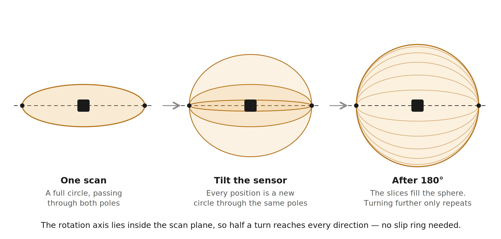

# 3D Room Scanner

A 3D room scanner built from a 2D LiDAR, a stepper motor, and 3D-printed parts.
**190,000 points in 90 seconds.**



The YDLIDAR X2L only measures a single horizontal slice. Mounted in a motorised tilting yoke
and swept through 180°, it becomes a full spherical scanner.

---

## The idea

A 2D LiDAR sweeps a plane. Reaching 3D needs a second axis — but the amount of rotation
required is less obvious than it looks.

Mount the sensor so that **the rotation axis lies inside the scan plane**. Each slice is then a
full circle through that axis, and rotating a plane 180° about an axis it contains sweeps it
through every possible orientation. One stop-to-stop pass covers the entire sphere. Going
further only re-scans what you already have.

That halves the travel a naive design would need, which means no slip ring and no
continuous-rotation wiring — just a service loop and two hard stops.

A point measured at in-plane bearing `θ` and range `d`, with the axis tilted by `β`:

```
x = d·cos θ
y = d·sin θ·cos β
z = d·sin θ·sin β
```

`θ` is measured **from the rotation axis**, so `θ = 0` is invariant under `β` — that ray never
moves as the axis tilts. That property is what the calibration exploits.

---

## Results

| | |
|---|---|
| Scan time | 91 s |
| Points per scan | 190,532 |
| Return rate | 79% |
| Corrupted packets | 0 of 242,270 rays |
| Sweep self-consistency | 6 mm, against 456 mm typical |
| Plane fit RMS | 9.5 mm over 28,386 points at 2.15 m |
| Angular step | 0.75° of tilt per full motor step |

The sweep self-consistency figure is worth explaining. A 180° sweep returns the scan plane to
where it started, mirrored, so the last slice must equal the first reflected about the pole.
Scoring that agreement measures the scanner's own angular error **without reference to the
scene**, and simultaneously proves the drive didn't lose steps.

---

## Quick start

No hardware needed — a real scan is included.

```bash
git clone https://github.com/NaoiseL/3D-Room-Scanner
cd 3D-Room-Scanner/software
pip install -r requirements.txt

python scan3d.py selftest                      # geometry checks
python x2l.py selftest                         # protocol decode, vs the datasheet's example

python scan3d.py verify  --raw ../data/sample_room.csv
python scan3d.py build   --raw ../data/sample_room.csv --offset 179 --mirror --out room.ply
python scan3d.py measure --raw ../data/sample_room.csv --offset 179
```

Open `room.ply` in [CloudCompare](https://cloudcompare.org) or MeshLab.

---

## Hardware

| Part | Notes | ~€ |
|---|---|---|
| YDLIDAR X2L | 0.12–8 m, 3000 Hz, 5–8 Hz scan, 0.84° resolution | 70 |
| NEMA 17 stepper | 1.8°/step | 12 |
| DRV8825 driver | 1/8 microstepping | 8 |
| Arduino Uno | Step generation and homing | 20 |
| 608 bearings ×2 | Tilt axis | 4 |
| 4S lithium pack + switch | Motor supply, 14.8 V nominal | 20 |
| USB power bank | Sensor supply, kept off the motor ground | — |
| Printed parts | Yoke, housings, gears, hard stops | 10 |

### Wiring

Go by the **printed labels** on the driver — some clone boards mirror the pin rows.

| DRV8825 | To |
|---|---|
| VMOT / GND | Battery pack, through the switch |
| A1, A2 / B1, B2 | Motor coil pairs |
| STEP / DIR / ENABLE | D3 / D4 / D5 |
| M0 / M1 / M2 | D8 / D9 / D10 |
| RESET + SLEEP | Arduino 5 V, tied together |
| GND (logic) | Arduino GND |

There is **no VDD pin** on the DRV8825 — it derives its logic supply from VMOT, so the driver
is completely dead without the motor supply. `RESET` and `SLEEP` are inputs and must be pulled
high or nothing responds.

Three power domains, one ground. Motor from the battery pack; Arduino from the host's USB;
sensor from a separate USB supply so motor return currents stay off its ground. Motor and logic
returns are run as separate wires meeting at the pack negative.

Three things that damage hardware: connecting the motor with the driver powered, omitting the
100 µF electrolytic across VMOT, and setting the current limit with the motor attached. Set
VREF to 0.25 V for a 0.5 A limit — far below the motor's rating, and ample for a balanced 125 g
load.

---

## Build

Gears are 20T/48T at module 1.25, 20° pressure angle, 2.4:1 — chosen so **one full motor step
is 0.75° of tilt**. That matters: the DRV8825's intermediate microsteps are not evenly spaced,
so the reduction is sized to keep every commanded position on a real full-step detent and take
microstep accuracy out of the error budget entirely.

* Print gears flat on the bed, teeth up, 4 perimeters, no supports. Never on edge — printed
  layers peel apart under tooth load.
* 0.12 mm backlash allowance. Zero-clearance printed gears bind.
* **Slot the motor mounting holes.** No printer hits a 42.5 mm centre distance first time.
* Ream the bores after printing. A 5 mm printed hole comes out around 4.8 mm.
* **Get the assembly close to balanced about the tilt axis.** An off-centre mass applies a
  moment that reverses sign through neutral, which can drive the gear teeth against alternate
  flanks mid-sweep. This build is only roughly balanced — unpowered it holds near neutral but
  falls away at steep angles, and in use it relies on the stepper's holding torque. That proved
  sufficient, but don't assume it: the `verify` residual measures any flank crossing directly.
* Two hard stops, 180° apart. No endstop switch is needed — see homing below.
* Keep the plane where the scan cuts the drive gear clear of everything. The gear rotates with
  the sensor, so anything on that line blocks the beam permanently.

STLs in [`cad/stl/`](cad/stl).

---

## Usage

Upload [`firmware/tilt_axis/tilt_axis.ino`](firmware/tilt_axis), then in the Serial Monitor at
115200 with Newline line endings:

| Command | Action |
|---|---|
| `?` | Status: position, degrees, endstop, direction |
| `C` | Crash home against the hard stop |
| `F<n>` | Step `n` full steps |
| `D1` / `D0` | Direction |
| `Z` | Zero here, manual datum |
| `T` | Self test |

Send `C`, **close the Serial Monitor**, then:

```bash
python scan3d.py scan      --lidar COM4 --arduino COM5 --out room.csv
python scan3d.py verify    --raw room.csv
python scan3d.py calibrate --raw room.csv --offset <from verify>
python scan3d.py build     --raw room.csv --offset <n> --oz <n> --gamma <n> --mirror --out room.ply
python scan3d.py measure   --raw room.csv --offset <n> --oz <n> --gamma <n>
```

Capture and reconstruction are deliberately separate. Scanning writes raw `(β, θ, range)` to
CSV; everything after is an instant second pass. Never re-scan to change a parameter.

### Reading the output

* **`scan` return rate below 60%** — the room exceeds the sensor's 8 m range, or the scanner is
  against a wall. Move toward the middle or pick a smaller space.
* **`verify` disagreement above ~300 mm at every candidate** — the drive lost steps, or
  something in the scene moved. That scan is not recoverable; rescan.
* **`build` extents** — one of the three should be your ceiling height. If none is, the offset
  is wrong.
* **Room comes out mirrored** — add `--mirror`. YDLIDAR bearings increase clockwise, which
  combined with the drive direction makes the reconstruction left-handed. This is a fixed
  property of a given build; determine it once against an asymmetric feature, then leave it set.
* **`measure` finding planes 0.3 m apart** — those are furniture, not walls. Calibrate on a
  clean scene; a cluttered room supplies cabinet doors and appliances as "planes" and the solve
  gets pulled in inconsistent directions.

---

## Homing without a sensor

The DRV8825 is a constant-current chopper: it regulates coil current regardless of load, so a
stall produces **no measurable electrical signature**. Sensorless homing of the kind a TMC2209
offers is not available.

Instead the axis drives deliberately into a printed hard stop and skips teeth. Crude, but
repeatable across trials — and repeatability is the only property that matters, since a
consistent offset is absorbed by the extrinsic calibration. `C` overshoots by 8 full steps so
it reaches the stop from anywhere in the travel, then eases off so the gears aren't left loaded.

---

## Calibration

Three things must be recovered before the cloud means anything.

**Axis bearing** — which in-plane bearing points along the rotation axis. Recovered by the
mirror-consistency test described under Results, which is independent of the scene. An earlier
method based on range invariance at the pole was abandoned after it confidently locked onto a
yoke arm occluding the beam: a fixed obstruction holds constant range across the sweep exactly
as a true pole does, and the two are indistinguishable to that test.

**Extrinsics** — the sensor's optical centre does not sit on the rotation axis, and the scan
plane isn't perfectly aligned to it. Both are solved by maximising the mutual squareness of the
extracted surfaces, since real walls, floors and ceilings are perpendicular. The lever arm
rotates *with* the sensor, so it is applied before the tilt rotation, not after.

**Handedness** — one flag, fixed per build, as above.

---

## Angle correction

The X2L datasheet specifies a per-point correction for the triangulation geometry:

```
correction = atan(21.8·(155.3 − D) / (155.3·D))     degrees
```

Omitting it bows flat walls subtly enough to be mistaken for a mechanical fault. `x2l.py`
implements the protocol directly from the development manual rather than the vendor SDK, and
`--no-correction` disables the term so the systematic error it removes can be plotted and
measured rather than taken on faith.

---

## Limitations

* 8 m maximum range confines this to rooms, not large spaces.
* Step-and-settle capture assumes a static scene for the full 90 seconds.
* Range bias is not characterised across distance; only relative precision is quantified.
* The solid drive gear removes about 3.4% of the sphere at one pole. A spoked ring gear would
  recover most of it.

## Planned

* Continuous-sweep capture with timestamp interpolation and point deskewing, benchmarked
  against step-and-settle as ground truth.
* Multi-position scans registered with ICP to fill occlusions.
* Camera–LiDAR fusion to colourise the cloud, adding a second extrinsic calibration.

---

## Repository layout

```
firmware/tilt_axis/    Arduino stepper control, homing, serial command set
software/x2l.py        YDLIDAR X2L driver, protocol implemented from the datasheet
software/scan3d.py     capture, calibration, reconstruction, measurement
cad/stl/               printable parts
data/                  a real scan, so the pipeline runs with no hardware
docs/images/           figures
```

## Licence

MIT
